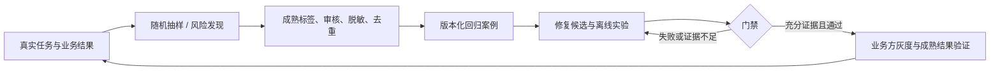

# Agent Eval

面向多业务企业 Agent 的本地评测框架。接入自己的 Agent 和数据，即可校验数据、执行多版本实验、独立评分、查看报告，并将经过审核的线上失败回流为回归案例。

**当前版本 v0.2.0**：Python 3.10+，运行时仅依赖标准库；支持 Python / HTTP / command 接入、规则与可选 LLM 评分、重复试验、断点恢复及离线 HTML 报告。内置测试 Agent 和数据均为模拟，不调用付费模型。真实业务效果由你在本地提供的数据与独立 oracle 验证。

## 十分钟跑通

```bash
git clone https://github.com/BruceLiu-168/agent-eval.git
cd agent-eval
python -m venv .venv
source .venv/bin/activate
python -m pip install .

# 建议将自己的数据项目放在代码仓库外。
agent-eval init ../my-agent-eval
cd ../my-agent-eval
agent-eval validate --config eval.json
agent-eval run --config eval.json --out runs/first
```

Windows 的环境激活命令为 `.venv\Scripts\activate`。打开 `runs/first/report.html` 查看报告；同目录还有 `report.json`、`results.csv`、`manifest.json` 和 `records.jsonl`。HTML 无外部资源依赖，可直接离线查看。

演示候选在 13 个场景中得到 **11 pass、2 infra_error**；门禁为 **INCONCLUSIVE**。这是刻意保留的依赖故障和证据不足，不能解释成真实业务验证通过。`run` 默认退出码 0 仅代表实验执行完毕；CI 使用 `--enforce-gate`，或执行 `agent-eval gate --report runs/first/report.json`，只有门禁 PASS 才返回 0，BLOCK 返回 2，INCONCLUSIVE 返回 3。

```bash
# 安装后独立验收：三种接入 + 本地 HTTP Agent + 断点恢复。
agent-eval self-test

# 相同配置、数据和实现下恢复，只补未写入 checkpoint 的任务。
agent-eval run --config eval.json --out runs/first --resume
```

## 接入真实业务

1. 将 `data/cases.jsonl` 替换为业务案例，定义 `expected_state`、`expected_output`、`checks` 或 `rubric`；真值来自业务规则、可信状态观察或专家标签。
2. 修改生成的 `custom_adapter.py`，或选择 HTTP / command 模板；返回真实 `output`、工具 `events` 和独立读取的 `final_state`，缺少成本或延迟时保留 `null`。
3. 在 `eval.json` 中冻结 Agent 版本、执行次数、预算和评分器版本，然后运行。不同版本可用 `version_adapters` 指向不同服务或程序。
4. 用固定回归集检查修复，用独立留出集检查泛化；再以成熟的线上业务结果确认效果。

已有历史执行记录时无需再次调用 Agent：

```bash
agent-eval evaluate --dataset data/cases.jsonl --episodes data/episodes.jsonl --out runs/replay
```

完整步骤和可复制示例见 [本地使用指南](docs/LOCAL_USAGE.md) 与 [数据、接入及评分契约](docs/DATA_CONTRACT.md)。`init --template http` 生成 HTTP 项目，另开终端执行 `agent-eval serve-agent --port 8765` 即可使用内置测试服务。

## 三种方案与取舍

建议组合 **A 离线门禁 + B 线上回流**，关键写操作业务加入 **C 状态仿真**。

| 方案 | 已实现 | 优点 | 代价与边界 |
|---|---|---|---|
| A：离线评测与门禁 | 多版本实验、输出/状态/轨迹评分、重复试验、版本指纹、保守统计门禁 | 本地接入简单，可追踪回归，能接 CI | 静态集会过拟合；需要独立真值和留出集 |
| B：线上证据回流 | SQLite 接入、随机/风险双流、延迟标签、审核、脱敏和幂等回流 | 持续发现实际分布中的失败，形成复测数据 | 需要业务结果与人工审核；本地存储不承担生产高吞吐采集 |
| C：有状态测试 Agent | 退款/授权环境，正常/回归版本，故障、幂等、审批和交接场景 | 验证副作用与工具轨迹，框架验收无需模型密钥 | 每个业务要维护状态模型；合成通过率不能替代真实效果 |



框架提供采集文件接入至回流复测及门禁判定；生产 Trace 采集、灰度和回滚由业务系统集成。`agent-eval demo --out artifacts/demo` 可运行旧版三方案闭环演示。

## 指标如何解读

- `pass / fail / unknown / infra_error` 分开统计；评分超时、无真值、缺业务状态都不会自动通过。已观察到的严重违规不能被评分器故障掩盖。
- 报告同时展示已判定样本通过率、全部执行通过占比、证据覆盖率和数据集覆盖率；只导入部分用例时明确列出缺失数量。
- 重复试验的“至少一次成功”和“每次都成功”分开展示。门禁按 case 的全部试验聚合，再以独立 `family_id` 为单位，不靠重复执行虚增独立样本。
- 未提供的费用不补零；Agent 上报时延与框架实测调用时延分开，模拟数据保留来源标记。
- 线上质量估计只基于成熟且有标签的随机样本；风险样本用于发现失败。缺失标签可能带来偏差。

## 执行与数据边界

新 `run` 路径将 Agent 和评分器放入带超时的子进程，限制输入/输出体积，不自动重试写操作。它是执行控制，不是针对恶意代码的安全沙箱。向 Agent 传递的 Case 使用白名单，参考答案、rubric 和评测元数据不会被 Runner 传入；进程仍拥有本地文件与网络权限，敏感留出集的强隔离需另配容器或独立环境。

恢复只跳过已持久化的结果。如果进程在业务写入之后、结果落盘之前中断，恢复可能再次执行该任务；真实业务必须使用沙箱、稳定幂等键或可恢复的任务 ID。HTTP 本地超时也不保证远端操作已取消。报告与 checkpoint 留在本地，原始记录可能含业务数据，应按本地访问规则保存；默认忽略 `data/`、`runs/`、`.env` 等，不将其提交到 Git。

LLM judge 需显式配置服务地址、模型、版本和密钥环境变量。启用后会向该服务发送评分所需文本；默认规则评分和内置验收均离线运行。脱敏能力只是基础敏感键与邮箱处理，不能代替完整业务脱敏。人工标注 UI、生产多租户门户、托管流量接入和灰度控制未包含在本地框架中。

## 开发与资料

```bash
python -m unittest discover -s tests -v
python -m agent_eval self-test
python -m pip wheel . --no-deps -w dist
```

[交付目标](docs/GOAL.md) · [验收记录](docs/VALIDATION.md) · [厂商调研](docs/RESEARCH.md) · [美团方法](docs/RESEARCH_MEITUAN.md) · [架构与统计门禁](docs/DESIGN.md)
