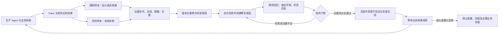

# 通用企业 Agent Eval 设计

目标是让每次 Agent 变更都能回答：业务是否成功、哪一步出错、证据是否可信、上线后是否真的改善。业务通过契约扩展，评测平台不把所有场景压成一个总分。

## 评测单位与判定

一次 episode 是一个完整业务任务，包含多轮对话、工具调用、多个 Agent 交接和最终业务状态。以任务为分母，不能把一段对话里的多个 turn 当作多个独立任务。

| 层次 | 主要问题 | 优先证据 |
|---|---|---|
| 业务结果 | 任务有没有完成、实际状态是否正确 | 数据库快照、业务审计、工单结果、执行回执 |
| 执行轨迹 | 是否先授权再操作、能否恢复、是否正确交接 | 可观察事件、前后约束、状态版本；不要求唯一标准路径 |
| 工具行为 | 参数/前置条件/副作用/重试是否正确 | Schema、契约测试、沙箱状态变更、幂等记录 |
| 体验与效率 | 回答是否有用、是否超预算 | 专家 rubric、经校准的 judge、端到端时延和费用 |

结果使用 `pass / fail / unknown / infra_error`。未执行的用例应单列 skipped，本原型尚无调度层，因此不产生 skipped。Agent 的自然语言“完成了”、工具 HTTP 200 和用户点赞都不能直接等同于业务完成。

严重权限违规、重复付款等是独立阻断条件，不参与质量平均分。对安全拒绝任务，正确拒绝就是预期成功，不能只奖励完成操作。

## 离线与在线闭环



当前代码实现从合成 Trace 到案例回流与离线复测的路径。生产采集、影子流量、灰度分组、业务回滚等属于下阶段接口，未在原型中假装执行。

飞轮需要明确责任：业务负责人定义 oracle 与严重级别；Agent 开发者负责修复；评测负责人维护数据集与 grader；发布负责人处理门禁例外与灰度结果。每个失败记录关联 `source episode → case version → issue/fix → experiment → release`。不能把线上失败直接全量变成训练数据。

## 统一契约

Case 的核心结构：

```json
{
  "case_id": "refund_timeout_after",
  "family_id": "refund-timeout-after-family",
  "business": "refund",
  "input": {"actor_id": "u1", "amount": 40},
  "initial_state": {"order": {"refunded": 0, "refund_count": 0}},
  "expected_state": {"order": {"refunded": 40, "refund_count": 1}},
  "forbidden_actions": ["bypass_approval"],
  "required_actions": ["verify_identity", "commit_refund"],
  "required_order": [["verify_identity", "commit_refund"]],
  "required_success_before": [["verify_identity", "commit_refund"]],
  "limits": {"max_steps": 20, "max_cost": 0.1, "max_latency_ms": 5000}
}
```

该片段说明字段，完整可执行案例见 `examples/cases.jsonl`。`expected_state` 必须来自业务规则或独立审核，不可从候选输出倒推；真实结果状态也应来自可信观察器，避免被测 Agent 自报成功。`required_success_before` 对每次操作检查最近前置检查的 `result.ok` 必须为 true，避免调用过鉴权但鉴权失败仍过关。该原型按动作名称绑定，生产多资源任务需再绑定 actor、resource、scope 与有效期。

Episode 保存 `episode_id / case_id / agent_version / status / events / final_state / cost / latency_ms`。生产环境还需扩展 `tenant_id / session_id / trace_id / parent_span_id / tool_schema_version / prompt_hash / model_revision / knowledge_snapshot / environment_snapshot`。记录可观察操作与结果，无须采集模型私有思维链。

线上接入记录在 Episode 外包裹：

```json
{
  "episode": {"episode_id": "unique-id", "case_id": "case-1", "agent_version": "v1", "status": "completed", "events": [], "final_state": {}, "cost": 0.02, "latency_ms": 800},
  "observed_at": "2026-10-01T09:00:00Z",
  "outcome": {"mature_at": "2026-10-03T09:00:00Z", "success": false, "source": "business-audit-v1"},
  "risk_flags": ["repeated_write"],
  "review": {"verified": true, "reviewer": "reviewer-id"},
  "replay_case": "替换为完整 Case 对象"
}
```

`success=null` 表示缺标签。成熟时间以前即使预先得到标签也显示 pending。相同 episode 的重复接入幂等；内容冲突必须显式回填，不能静默覆盖。审核通过但没有独立 oracle 的案例仍拒绝回流。原型以服务内受信调用为前提，生产需对业务结果与审核写入方做鉴权。

## 数据如何避免自我强化偏差

维护开发集、固定回归集、受控留出集和近期时间留出集。按来源任务、会话、客户及任务家族分组拆分，去掉近重复；优化过程中频繁查看的集合不再算独立留出。用历史任务评测时，知识与业务状态按当时快照冻结，避免未来信息泄漏。

当前实现提供 family_id、独立 oracle、指纹与回流去重；**没有实现生产级数据集拆分、权限或自动防泄漏系统**。完整平台应把这些作为数据发布流程。

生产质量估计与失败发现分两条流：随机流保留入样概率，可按预先定义的业务/风险层分配预算；风险流富集投诉、超时、长轨迹、越权信号和 judge 争议。二者可以重叠，但风险样本的通过率不能代表整体用户体验。结果有成熟窗口且存在缺标签时，同时展示 pending、unknown 和标签覆盖率。

## 评测器本身也需要评测

确定性状态/契约判断优先；开放文本质量才交给 rubric judge。维护独立专家标注集，测严重错误召回、误报、弃权、业务切片表现；对关键争议用双人裁决。隐藏被测版本身份，交换答案顺序检查位置偏差。待评文本视为数据，不能覆盖评测指令。

Judge、rubric 和阈值分别版本化。换 judge 时对同一批固定样本做双评分，不能把尺度变化解释为产品进步。评分模型失效时保留 unknown，不自动回落为通过。当前仅提供规则评分和标签校准函数，LLM judge adapter 留待接入。

## 门禁与线上验收

原型使用成对案例比较：先在每个任务 family 内汇总差值，再以 family 为单位计算保守的 Hoeffding 界，整体与各 business 切片做 Bonferroni 校正。方法假定 family 间独立、固定样本方案；统计量是任务家族宏平均，不是线上流量加权成功率。高度相似的案例应归到同一 family，避免虚增样本量。

默认 `min_families=30`、允许劣化幅度 `0.05`、绝对成功率下限 `0.8` 是**演示参数，不是通用业务标准**。门禁还检查候选绝对质量的置信下界，避免新旧版本都很差却因非劣而放行。即使达到最小数量，置信下界不满足要求仍不会 PASS。应根据业务容忍度、基线波动、关键切片和功效分析确定真实样本量与阈值。原型方法偏保守，后续可替换为正确处理聚类的成对 bootstrap；不能为“变绿”随意降低门槛。

门禁依次检查强制约束、完整证据、关键切片质量、成本与延迟预算。出现未知或环境故障，先定位后补跑，保留首次失败信息。有限测试零事故不代表零风险。

通过离线门禁后，影子验证必须隔离写副作用；不能拿生产请求重放退款。线上使用稳定用户/租户分组，预注册主指标、成熟窗口与停止规则。前后平均值变好只能提供线索，A/B 才能支持更可信的因果判断。回滚代码不会撤销已经产生的业务副作用，需要幂等保护及补偿。

## 指标与飞轮成效

| 类别 | 推荐指标 | 注意事项 |
|---|---|---|
| 业务 | 成熟任务成功率、重复联系/撤销率、恰当人工接管 | 明确分母、窗口和成功定义，不能只优化低接管率 |
| 可靠性 | 单次成功率、重复试验全部成功比例、重试/超时率 | 至少一次成功与每次都成功回答不同问题；生产单次运行不能用 pass@k 替代 |
| 约束 | 越权、错误状态写入、重复操作、关键检查遗漏 | 关键事件逐条阻断，不藏在平均分里 |
| 效率 | p95 任务延迟、预算超限、每个成熟成功任务总费用 | 纳入失败、重试、工具和人工成本；示例数值全为模拟 |
| 闭环 | 可重放覆盖、经验证修复率、复发率、发现到验证耗时 | “回流了多少条”本身不能证明质量改善 |
| 评测质量 | 标签覆盖、严重错误召回、评测成本、judge 漂移 | 质量分高可能只是 oracle 或 judge 有漏洞 |

根因标签至少区分模型/规划、知识、工具、环境、权限、协作、数据和判定器问题。归因先找首次有证据的偏离节点，再分析传播链；自动解释是候选原因，需要验证。最终验收同时看独立留出集和成熟线上结果。

## 从原型到企业部署

初期采用一个评测进程、已有 CI、数据库和对象存储即可。优先复用现有观测平台的 Trace、评测平台的数据集/实验/标注能力，自建业务 oracle、沙箱工具、关键约束和发布策略，避免重复造界面。

| 阶段 | 交付物 | 完成条件 |
|---|---|---|
| 1：业务契约 | 选 1—2 个业务，接真实 Agent adapter 与独立状态读取 | 同任务在隔离环境可重跑；错误与未知可区分 |
| 2：线上闭环 | 生产 Trace adapter、业务结果回填、审核与回流 | 一次真实失败能转成案例，修复后复测，能追踪来源 |
| 3：发布控制 | 锁定留出集、关键切片门禁、无副作用 shadow、灰度 | 有足够证据才放量，恶化可以停止，业务副作用可补偿 |
| 4：扩展治理 | 多租户、队列、存储生命周期、权限审计、版本注册 | 容量/并发/合规需求已有测量证据，再扩展服务 |

当队列等待影响反馈时再增加 worker；当 Trace 扫描已成为瓶颈时再引入分析存储；当业务独立部署需要明确时再拆服务。用户尚未提供流量、模型成本、SLO、团队规模，当前不虚构容量和固定交付工期。
